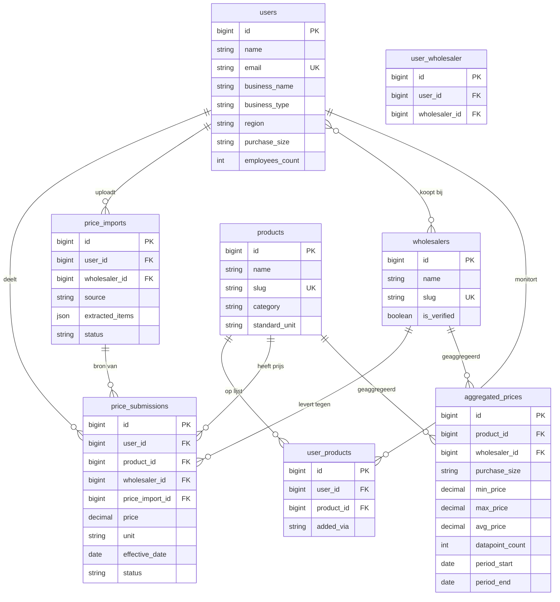

# PriceSignal — Datamodel

> Technische referentie voor het databaseschema van de Laravel-app (`app/`).  
> Functionele context: [`FUNCTIONALITEIT.md`](../FUNCTIONALITEIT.md)

**Laatste update:** juni 2026 (`user_products` geïmplementeerd — Fase 3d-1/2)  
**Database (dev):** SQLite · **Database (prod):** PostgreSQL (gepland)

---

## Overzicht

PriceSignal slaat drie soorten data op:

| Laag | Tabellen | Zichtbaarheid |
|---|---|---|
| **Leden** | `users`, `user_wholesaler`, `user_products` | Alleen eigen account |
| **Ruwe prijzen** | `price_imports`, `price_submissions` | Alleen eigen bedrijf |
| **Marktkennis** | `aggregated_prices` | Anoniem, geaggregeerd (tonen vanaf 1 meetpunt — §4.8) |
| **Referentie** | `products`, `wholesalers` | Gedeeld, geen bedrijfskoppeling |

**Kernprincipe:** individuele `price_submissions` zijn nooit publiek. Vergelijkingen gebruiken `aggregated_prices` of live-berekeningen zonder het eigen bedrijf mee te tellen.

---

## Entity-relationship diagram



---

## Domeintabellen

### `users`

Horecalid — één account per bedrijf (uniek e-mailadres).

| Kolom | Type | Verplicht | Beschrijving |
|---|---|:---:|---|
| `id` | bigint | ✓ | Primaire sleutel |
| `name` | string | ✓ | Contactpersoon |
| `email` | string | ✓ | Uniek; ook gebruikt voor e-mail-upload |
| `email_verified_at` | timestamp | | E-mailverificatie (nog niet actief) |
| `password` | string | ✓ | Gehasht |
| `business_name` | string | | Bedrijfsnaam |
| `business_type` | string | | `restaurant`, `cafe`, `hotel`, `catering`, `other` |
| `region` | string | | Regio/stad (voor toekomstige segmentatie) |
| `employees_count` | smallint | | Optioneel |
| `purchase_size` | string(16) | ✓ | `small`, `medium`, `large` — inkoopomvang-segment |
| `remember_token` | string | | Sessie |
| `created_at` / `updated_at` | timestamp | ✓ | |

**Relaties:** `priceSubmissions`, `priceImports`, `wholesalers` (many-to-many via `user_wholesaler`), `userProducts` / `trackedProducts`

---

### `products`

Gestandaardiseerde productnamen. Aangemaakt via `Product::findOrCreateFromName()` bij upload.

| Kolom | Type | Verplicht | Beschrijving |
|---|---|:---:|---|
| `id` | bigint | ✓ | |
| `name` | string | ✓ | Weergavenaam, bijv. "Tomaten cherry" |
| `slug` | string | ✓ | Uniek; afgeleid van naam |
| `category` | string | | Productcategorie (toekomstig) |
| `standard_unit` | string | ✓ | Standaardeenheid, default `stuk` |
| `created_at` / `updated_at` | timestamp | ✓ | |

**Relaties:** `priceSubmissions`, `aggregatedPrices`, `userProducts` / `trackingUsers`

---

### `wholesalers`

Groothandels — vooraf gevuld via seeder + door leden toegevoegd.

| Kolom | Type | Verplicht | Beschrijving |
|---|---|:---:|---|
| `id` | bigint | ✓ | |
| `name` | string | ✓ | Bijv. "Sligro" |
| `slug` | string | ✓ | Uniek |
| `is_verified` | boolean | ✓ | Door platform bevestigd; default `false` |
| `created_at` / `updated_at` | timestamp | ✓ | |

**Relaties:** `priceSubmissions`, `aggregatedPrices`, `users` (many-to-many)

---

### `user_wholesaler`

Koppeltabel: welke groothandels een lid gebruikt.

| Kolom | Type | Verplicht | Beschrijving |
|---|---|:---:|---|
| `id` | bigint | ✓ | |
| `user_id` | FK → users | ✓ | |
| `wholesaler_id` | FK → wholesalers | ✓ | |
| `created_at` / `updated_at` | timestamp | ✓ | |

**Uniek:** `(user_id, wholesaler_id)`

---

### `user_products`

Persoonlijke productlijst per lid (Fase 3d-1/2).

| Kolom | Type | Verplicht | Beschrijving |
|---|---|:---:|---|
| `id` | bigint | ✓ | |
| `user_id` | FK → users | ✓ | |
| `product_id` | FK → products | ✓ | |
| `added_via` | string(16) | ✓ | `upload` · `manual` (`App\Enums\AddedVia`) |
| `created_at` / `updated_at` | timestamp | ✓ | |

**Uniek:** `(user_id, product_id)`

**Gedrag:** verwijderen uit lijst = rij wissen; `price_submissions` blijven bestaan. Auto-toevoegen na goedgekeurde upload via `UserProductService::addFromUpload()`.

**Relaties:** `user`, `product` — model `UserProduct`

---

## Prijsdata

### `price_imports`

Tijdelijke upload-batch vóór bevestiging door het lid.

| Kolom | Type | Verplicht | Beschrijving |
|---|---|:---:|---|
| `id` | bigint | ✓ | |
| `user_id` | FK → users | ✓ | Eigenaar |
| `source` | string | ✓ | `manual`, `photo`, `pdf`, `email` |
| `original_filename` | string | | Originele bestandsnaam |
| `file_path` | string | | Opslagpad (foto/PDF) |
| `wholesaler_id` | FK → wholesalers | | Gekozen na extractie |
| `effective_date` | date | | Factuur-/prijslijstdatum |
| `extracted_items` | json | | Ruwe AI-extractie (review) |
| `status` | string | ✓ | Zie statussen hieronder |
| `error_message` | text | | Bij mislukte extractie |
| `created_at` / `updated_at` | timestamp | ✓ | |

**Statussen (`PriceImport`):**

| Waarde | Betekenis |
|---|---|
| `extracting` | AI bezig met uitlezen |
| `review` | Wacht op controle door lid |
| `confirmed` | Bevestigd → `price_submissions` aangemaakt |
| `failed` | Extractie mislukt |

**Relaties:** `user`, `wholesaler`, `priceSubmissions`

---

### `price_submissions`

Definitieve prijsregel van één lid. Dit is de bron van waarheid voor vergelijkingen.

| Kolom | Type | Verplicht | Beschrijving |
|---|---|:---:|---|
| `id` | bigint | ✓ | |
| `user_id` | FK → users | ✓ | **Nooit publiek** |
| `price_import_id` | FK → price_imports | | Herkomst-batch |
| `product_id` | FK → products | ✓ | |
| `wholesaler_id` | FK → wholesalers | ✓ | |
| `price` | decimal(10,2) | ✓ | Bedrag in euro |
| `unit` | string | ✓ | Bijv. `kg`, `liter`, `doos` |
| `quantity_per_unit` | string | | Bijv. "5 kg" |
| `specification` | string | | Merk/variant |
| `effective_date` | date | ✓ | Peildatum (factuur-/prijsdatum) — verplicht; altijd tonen in UI naast prijs |
| `source` | string | ✓ | `manual`, `photo`, `pdf`, `email` |
| `notes` | text | | Vrije opmerking |
| `status` | string | ✓ | Zie statussen hieronder |
| `created_at` / `updated_at` | timestamp | ✓ | |

**Index:** `(product_id, wholesaler_id, effective_date)`

**Statussen (`PriceSubmission`):**

| Waarde | Betekenis |
|---|---|
| `pending` | Ingediend, nog niet goedgekeurd |
| `approved` | Meegenomen in aggregatie |
| `rejected` | Afgewezen |

**Relaties:** `user`, `priceImport`, `product`, `wholesaler`

---

### `aggregated_prices`

Anonieme marktstatistiek — berekend door `AnonymizationService`.

| Kolom | Type | Verplicht | Beschrijving |
|---|---|:---:|---|
| `id` | bigint | ✓ | |
| `product_id` | FK → products | ✓ | |
| `wholesaler_id` | FK → wholesalers | ✓ | |
| `purchase_size` | string(16) | ✓ | Segment: `small`, `medium`, `large` |
| `avg_price` | decimal(10,2) | ✓ | Gemiddelde |
| `median_price` | decimal(10,2) | | Mediaan |
| `min_price` | decimal(10,2) | ✓ | Laagste |
| `max_price` | decimal(10,2) | ✓ | Hoogste |
| `datapoint_count` | int | ✓ | Aantal unieke leden |
| `period_start` | date | ✓ | Aggregatieperiode start |
| `period_end` | date | ✓ | Aggregatieperiode einde |
| `created_at` / `updated_at` | timestamp | ✓ | |

**Uniek:** `(product_id, wholesaler_id, purchase_size, period_start, period_end)`

**Privacy:** anoniem geaggregeerd; tonen vanaf **1 meetpunt** (beleid §4.8). *Huidige code:* `MIN_DATAPOINTS = 3` — wordt verlaagd bij Fase 3d.

**Relaties:** `product`, `wholesaler`

---

## Enumeraties

### Inkoopomvang (`purchase_size`)

| Waarde | Label |
|---|---|
| `small` | Klein (tot €5.000/maand) |
| `medium` | Middel (€5.000 – €20.000/maand) |
| `large` | Groot (meer dan €20.000/maand) |

Gedefinieerd in `App\Enums\PurchaseSize`. Gebruikt op `users` en `aggregated_prices`.

### Bedrijfstype (`business_type`)

`restaurant` · `cafe` · `hotel` · `catering` · `other`

---

## Datastromen

### Upload → opslaan

```
price_imports (review)
    → lid bevestigt
    → price_submissions (status: approved)
    → AnonymizationService::aggregate()
    → aggregated_prices (per product + wholesaler + purchase_size)
```

### Vergelijking (`/compare`)

```
price_submissions (eigen lid, approved)
    +
aggregated_prices OF live stats (zelfde segment, ≥1 ander meetpunt, eigen prijs uitgesloten)
    → marktrange + positie in UI
```

---

## Laravel-modellen

| Model | Tabel | Pad |
|---|---|---|
| `User` | `users` | `app/Models/User.php` |
| `Product` | `products` | `app/Models/Product.php` |
| `Wholesaler` | `wholesalers` | `app/Models/Wholesaler.php` |
| `PriceImport` | `price_imports` | `app/Models/PriceImport.php` |
| `PriceSubmission` | `price_submissions` | `app/Models/PriceSubmission.php` |
| `AggregatedPrice` | `aggregated_prices` | `app/Models/AggregatedPrice.php` |
| `UserProduct` | `user_products` | `app/Models/UserProduct.php` |

Pivot `user_wholesaler` heeft geen apart model — relatie via `User::wholesalers()`.

---

## Frameworktabellen

Standaard Laravel-tabellen (niet domeinspecifiek):

| Tabel | Doel |
|---|---|
| `sessions` | Actieve sessies |
| `password_reset_tokens` | Wachtwoord reset |
| `cache` / `cache_locks` | Applicatiecache |
| `jobs` / `job_batches` / `failed_jobs` | Achtergrondtaken |

---

## Migraties

Alle migraties staan in `app/database/migrations/`. Volgorde:

1. `create_users_table` (+ sessions, password resets)
2. `add_member_fields_to_users_table`
3. `add_purchase_size_to_users_table`
4. `create_products_table`
5. `create_wholesalers_table`
6. `create_price_submissions_table`
7. `create_aggregated_prices_table`
8. `add_purchase_size_to_aggregated_prices_table`
9. `create_price_imports_table` (+ `price_import_id` op submissions)
10. `create_user_wholesaler_table`
11. `create_user_products_table`

```bash
cd app && php artisan migrate
```

---

## Geplande uitbreidingen (Fase 3d — §4.12)

> **Deels geïmplementeerd.** Specificatie: [`FUNCTIONALITEIT.md`](../FUNCTIONALITEIT.md) §4.12.

### Omzetklasse (`revenue_tranche`)

Vervangt `purchase_size` op `users` en `aggregated_prices`.

| Sleutel | Label | Jaaromzet |
|---|---|---|
| `t100k` | Tot €100k | &lt; €100.000 |
| `t500k` | €100k – €500k | |
| `t1m` | €500k – €1 mln | |
| `t2m` | €1 – €2 mln | |
| `t5m` | €2 – €5 mln | |
| `t10m` | €5 – €10 mln | |
| `t10m_plus` | €10 mln+ | |

Enum: gepland `App\Enums\RevenueTranche`. Migratie van bestaande `small` / `medium` / `large` bij implementatie.

### Datastroom Mijn producten

```
price_submissions (approved) ──► user_products (auto, added_via=upload)
handmatige zoekactie ──────────► user_products (added_via=manual)
user_products ─────────────────► /my-products (lijst + filters)
user_products + product ───────► /my-products/{product} (detail, historie)
aggregated_prices (revenue_tranche) ──► marktprijzen op lijst en detail
```

---

*Wijzig het schema altijd via migraties. Werk dit document bij bij structurele wijzigingen.*
